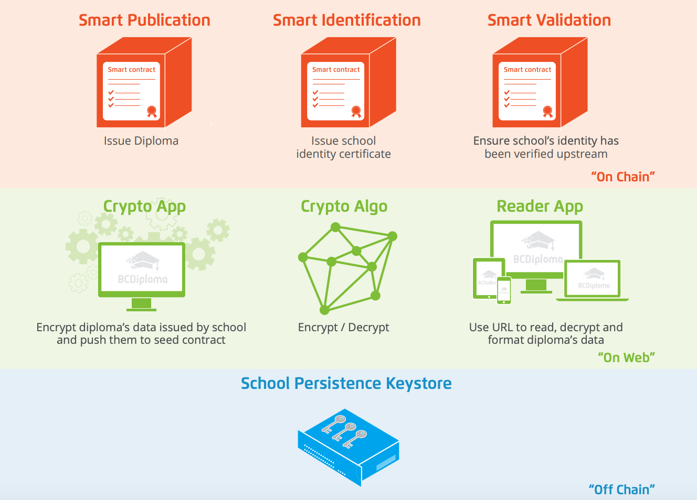

# DIPLOMAS, CERTIFICATES, BADGES AND MICRO-CERTIFICATIONS ON THE BLOCKCHAIN

## *Overview and Origin*

**BCdiploma** is a startup from France that is active in the digital credential space. They allow academic institutions to configure and grant digital verifiable diplomas, certificates, and transcripts. BCdiploma achieve this through the use of blockchain. The company was founded in 2017 by Luc Jarry Lacombe and Vincent Langard. 

According to Crunchbase, the company has raised two rounds of financing since 2018. In 2018, they raised a seed round of 1.9 million euros. Subsequently in 2019, they did another venture round for 1.2 million euros. The company has raised a total of 3.2 million euros of VC funding. 

## *Business Activities*

Unfortunately, the paper format of degrees and certificates can be easily tampered with. According to FBI, the credential fraud is a major concern. By replacing the traditional paper diplomas with verifiable digital credentials, the company is aiming to make the credentials more reliable, verifiable, and in the process increase the efficiency of creating and verifying diplomas in academic institutions. 

The intended customers of the company are all academic institutions as well as any organization that issues certificates. 

BCdiploma has a patent on the way they encrypt the data before hashing it and putting it on the chain. It gives them an unfair advantage especially in the European market as the organizations have to comply with more strict privacy laws. 

BCdiploma uses a framework called EvidenZ. The chain is fueled by Blockchain Certified Data Token (BCDT) which is an ERC-20 token. According to Zoominfo the company uses Amazon cloudfront and node js as part of their tech stack. EvidenZ blocks have three levels of classification:
* On-Chain: smart contracts - SmartValidation, SmartIdentification, SmartPublication;
* On Web: DApps - Crypto App and Reader App, with secured web access;
* Off-Chain: keystore.

## *Landscape*

BCdiploma’s main activity is in the certification verification domain. Their main focus is on badges, micro-certificates, and diplomas. The company is addressing a very specific niche by trying to help educational institutions to move away from paper diplomas and replace them with verifiable, tamper-proof digital ones.  

There are a few other competitors in the field. The initial project for creating, issuing, viewing, and verifying blockchain-based certificates started by MIT Media Lab and Learning Machine. Learning Machine sold its technology to Hyland. However, the MIT Media Lab's original project is still being maintained as an open-source standard for blockchain-based credentials. The standard is known as BlockCerts. Hyland Credentials and DiplomaSafe are other companies that are active in this domain. 

## *Results*

It seems that BCdiploma is at the early stages of onboarding customers. According to the company's website, they have 105 educational institutions using their system. These institutions span over 15 different countries. 

I believe the ARR would be a good metric to evaluate the company. One can also look at the utilization of the BCDT token. Unfortunately, there is no public data on the revenues of the company. However, a back of the napkin calculation may indicate an ARR of $500,000. On the other hand, as of the time of writing this article, there are 39,343,059 tokens available at the cost of $0.21. This indicates a market cap of $8.2 million. 

The larger competition is Hyland Credentials. They have a wider scope and bigger customer reach. The smallest and newest competitor is DiplomaSafe. 

## *Recommendations*

I suggest that the company create different verticals for their technology and offer their services to HR companies and healthcare. This will help them increase their market share by onboarding more customers in a variety of different verticals.

Overall, the technology and the concept seem to address a valid business concern. However, there are a couple of drawbacks to BCdiploma's approach. Firstly, there may be concerns for institutions to put student information on a public chain. The use of private blockchains might be a more suitable solution. Secondly, the fact that the framework is built on Ethereum makes the cost of transactions a burden to the users of the system.

---

## References:

* https://www.bcdiploma.com/en
* https://www.evidenz.io/bcdt-token.html
* https://www.blockcerts.org/about.html
* https://www.hyland.com/en/platform/product-suite/hyland-credentials
* https://www.zoominfo.com/c/bcdiplomacom/461797862
* https://www.crunchbase.com/organization/bcdiploma